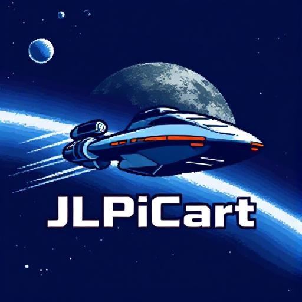
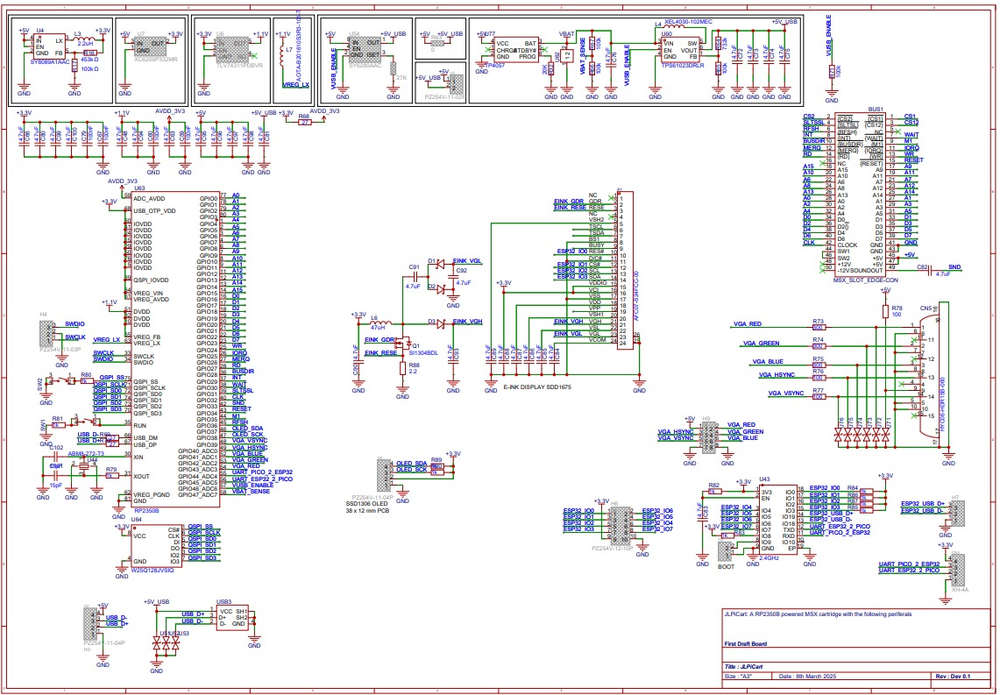
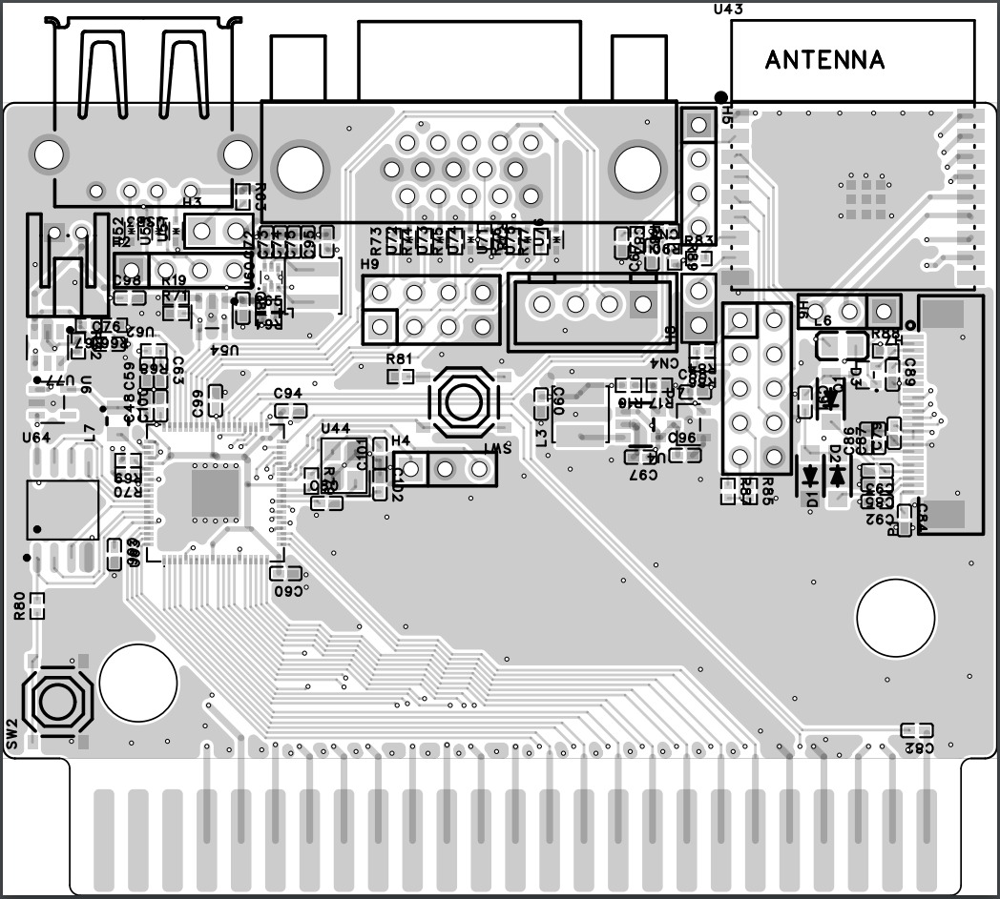
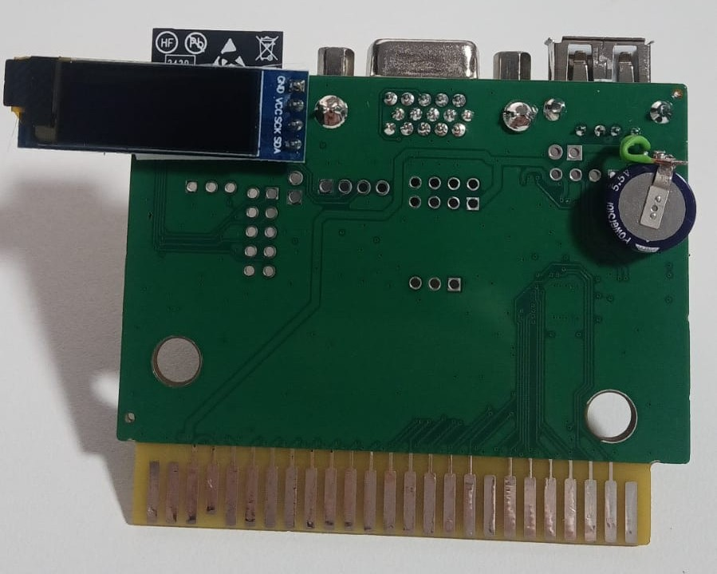
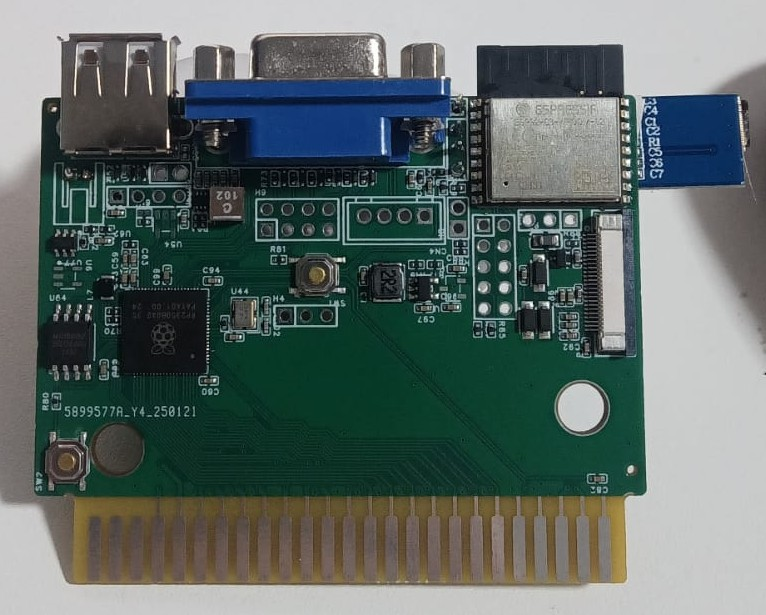

# JLPiCart - MSX Cartridge Based on RP2350B

JLPiCart is an experimental MSX cartridge design based on the RP2350B. This is a preliminary version with several known bugs, but early tests show promising results. We have ordered a small production run, and we are offering units to those interested in developing their own RP2350B firmware. If you'd like to obtain one, please contact me.

## Status
The firmware for the PCB is a work in progress. Some features are already functional, while others are still under development. Below is the current status of the key components:

| Feature              | Status                                        |
|----------------------|----------------------------------------------|
| RP2350B main CPU    | Hardware works and tested. Functional.       |
| Primary MSX slot    | Hardware works, code is there, works.        |
| Subslots            | Hardware works, code is there. Not working.  |
| VGA output          | Hardware works, code is there. Almost stable.|
| CRT output          | Hardware works, code is there. Almost stable.|
| TMS9918 emulation   | Hardware works, mode 2 support only. Almost stable. |
| WIFI and BT         | Communication with ESP32 achieved.           |
| E-INK interface     | Not tested.                                  |
| OLED screen         | Hardware works. Bitbanged I2C works.         |
| USB                 | Hardware works. Software is in early stages of development. |
| Battery overcharging| Still investigating hardware.                |

## Schematics and Images
Below are various images related to the JLPiCart hardware design:

### Schematic

### Top Assembly Drawing

### PCB Images
#### Front

#### Back

## Development
We are actively working on improving the firmware. Contributions and feedback are welcome. If you encounter any issues or have suggestions, feel free to reach out.

## Contact
For inquiries, development collaboration, or to request a unit, please contact me.

